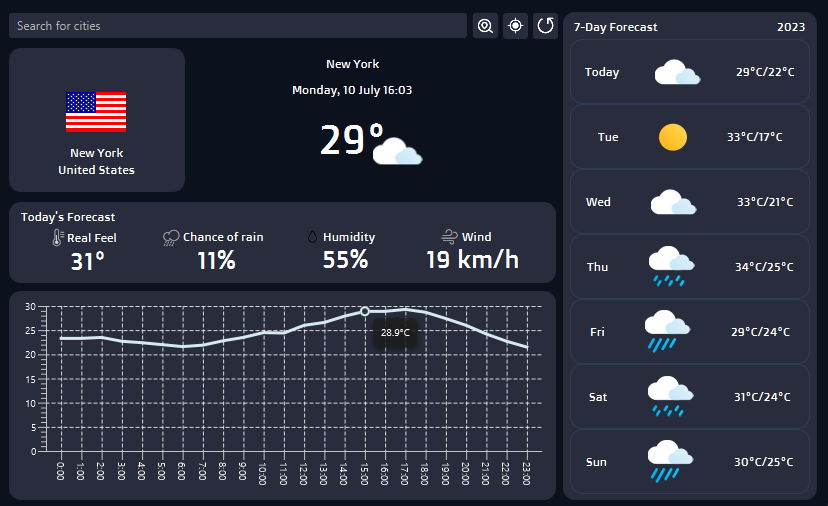

# WeatherAPP

Aplicativo de previsão do tempo desenvolvido em JavaFX com o objetivo de aprender como funciona a conexão e comunicação com APIs e como JSON funciona.

## Aprendizados

- Como fazer requisições a APIs.
- Como Parse Json em java usando a biblioteca GSON.
## APIs utilizadas

- Weather Forecast API: - [https://open-meteo.com/](https://open-meteo.com/en/docs)
- Geocoding API: - [https://open-meteo.com/](https://open-meteo.com/en/docs)
- IP-API: [https://ip-api.com/](https://ip-api.com/)
- Country Flag Icons: [https://countryflagicons.com/](www.countryflagicons.com)
## Bibliotecas utilizadas

- JavaFX: [https://openjfx.io/](https://openjfx.io/)
- Maven: [https://maven.apache.org/](https://maven.apache.org/)
- Gson: [https://github.com/google/gson](https://github.com/google/gson)
## Screenshots

## Anotações

Essa foi o um dos meus primeiros projeto, agora percebo que o código está bem confuso, além de mal dividido e organizado. Talvez no futuro eu possa refatorar o código deixando mais simples, ou até implementar algum padrão de projeto.
## Autores

- [@ViictorP](https://www.github.com/ViictorP)

## Licença

